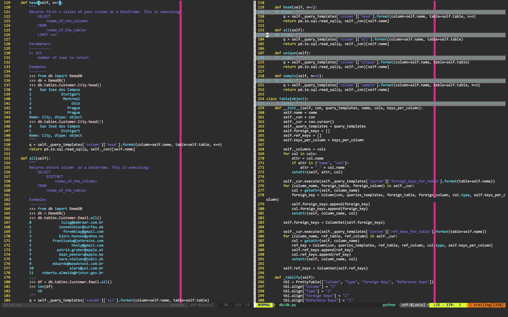

#vim-docstring

Python docstrings are great for helping others, but are sometimes too verbose
for a developer. Fold them with ease with this vim plugin.



## Install

If you use [pathogen](https://github.com/tpope/vim-pathogen) just clone to your bundle.

```bash
cd ~/.vim/bundle
git clone git@github.com:yhat/vim-docstring
```

If not, just stick [ftplugin/python.vim](./ftplugin/python.vim) in your 
.vim/ftplugin directory somewhere.

## Usage

This vim plugin defines exactly one command which you can auto-load by adding
the following to your .vimrc.

```vim
autocmd FileType python PyDocHide
```

Use the following vim commands to manipulate the folded docstrings.

* `za`: Toggle current fold.
* `zo`: Open the current fold.
* `zc`: Close the current fold.

See more help on the [vim wiki](http://vim.wikia.com/wiki/Folding#Opening_and_closing_folds).

To manually redraw the folds use the command `:PyDocHide`
